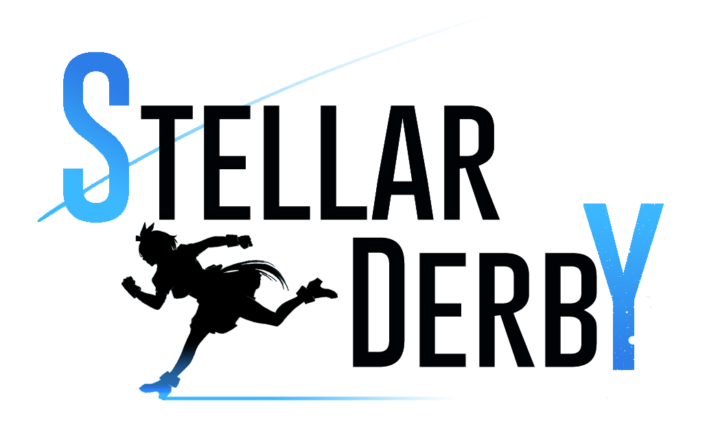

# 赛马娘：星海德比源代码库

### 说明

这里是群星mod赛马娘：星海德比的mod源代码库，这里有稳定的mod文件和正在开发中的mod文件，可供不能访问Steam创意工坊或者是想尝鲜的玩家下载。

现版本为：Ver0.3 P20

### 分支说明

master分支：最稳定的构建，并且与创意工坊的文件相同(可能会快于创意工坊)。

fitswc分支：F持续的维护分支，一般都会同步到master，但某些情况除外；相当于预览分支；为不稳定的构建。

Fitswc-Bourbon分支：F的新事件分支。

fitswc-NewResearchUi F的新研究ui

Fitswc-AscensionPeakⅡ F的飞升分支

⚠***以下为过时分支***

nian分支：0.3 开发时期由**年若水**维护的分支

rabbit分支：0.3 开发时期由**霜星兔兔**维护的分支

tom分支：0.3 开发时期由**Tommy**维护的分支

agnes_digital分支与digital分支：0.3开发时期由**数码**维护的分支

### 如何做出贡献？

1. 提出Issues让制作组成员知道你的全新创意或者是发现的bug
2. 加入我们的Q群就可以在里面找到所有的制作组成员，如果有mod上的问题/建议，可以直接提出。

### QQ群号

659256471
